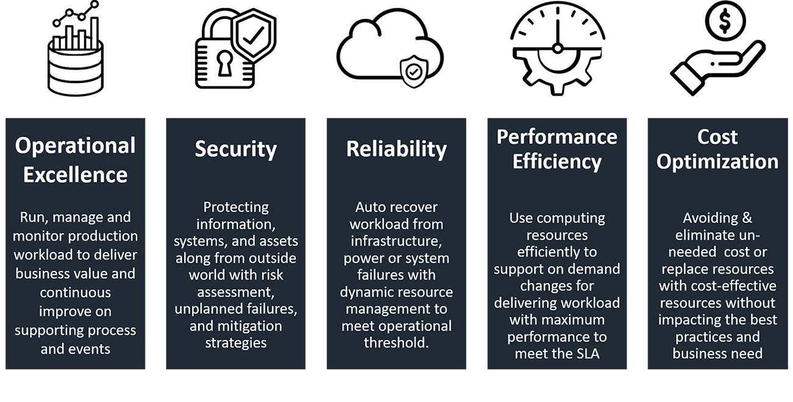

## AWS

AWS is a public cloud vendor that offers various cloud computing services, developments tools, and enterprise solutions to help businesses scale and grow faster.  


#### 5 Pillars of AWS Well architected-framework



### AWS cloud computing solutions:

#### Compute

EC2 - virtual machines on cloud

AWS Lambda - serverless solutions that allow to run functions whenever you need. 

EKS - managed Kubernetes platform

Beanstalk - automated deployment of resources for scalable web application

VPC - private networking of cloud resources

- Vnet
- Subnet
- CIDR
- VPN
- Routes
- Gateway
- Availability Zones

CloudFormation - Infrastructure as a code

#### Storage

S3 - simple storage service

EBS - block storage

Glacier - low cost, data archiving storage technology

 Storage gateway - storage for on-premise applications

#### Database

Amazon RDS - easy to setup, operate, scalable relational database

DynamoDB - NoSQL database

ElasticCache - in-memory cache solution

RedShift - Data warehousing solution. Offers Complex OLAP (Online Analytical Processing) features. Analyze information from multiple databases. 

##### Security

IAM - helps manage users and groups, assign policies and rules. 

WAP - Web application Firewall 

KMS - Key Management service - helps create and control encryption keys and encrypt data. 

#### Migration

Snowball - allows to transfer terabytes of data inside and outside of AWS. 

SMS (Server Migration Service) -  allows to migrate on-site servers to AWS

#### Analytics and Big Data

Athena, CloudSearch, ElasticSearch, Kinesis, QuickSight, EMR(Elastic Map Reduce)

#### Management Services

CloudWatch - monitors AWS resources like EC2, RDS. It triggers alarm depends on various metrics.

CloudFormation - IaaC (Infrastructure as a code) solution like Terraform but only focused on AWS

CloudTrail - used for auditing and logging AWS resources

OpsWorks - autoamate configurations on AWS enviroments

Service Catalog, Config, AWS Auto Scaling, System Manager

#### Internet of Thing

IoT Core, IoT Device management, IoT Analytics, Amazon FreeRTOS

### Developer Tools

CodeStar, CodeCommit, CodeBuild, CodeDeploy, CodePipeline, Cloud9

#### Application Services, Mobile Services, Business Productivity, AI, AR & VR, Game Development, etc


## AWS EC2

### CIDR Notation (Classless Inter-Domain Routing)

```
X.X.X.X/n
```

where X is the 8 bits of IP address range from 0-255.

n is the number of fixed bits

IP address = 32 bits (4 x 8 bits)

IP ranges are specified according to the number of fixed bits

*For example:*

`192.168.55.31/32` means all bits are fixed hence it is only a single IP

`192.168.55.0/24` = 256 address is available starting 192.168.55.0 to 192.168.55.255

`192.168.0.0/16` =  65,536 address is available starting 192.168.0.0 to 192.168.255.255

`192.168.96.0/20` =  4,096 addr is available starting 192.168.96.0 to 192.168.111.255

VPC allowed block size between /28 and /16

AWS reserved IP addresses in first four IP and the last IP. You cannot use it

### EC2 IP Addresses

#### Private Addresses

Automatically assign from subnet

Not directly routable to the internet

At least one private address is required

#### Public Address

Optional

Directly routable to the internet

Randomly assigned from Amazon's pool of public API

Subnet auto-assign Public IP settings

Returns to AWS when instance stops or terminates

#### Elastic Address

Requested and controlled by account

Associate to instance.

Tied to region

One free per instanceYou can request up to 5 per instance

Additional charge if not associated with a running instance

#### Elastic Network Interface (ENI)

##### Default primary network interface

eth0

Cannot be detached

##### Additional secondary network interfaces

eth1 -> ethn

Can be attached and detached

##### ENI Attributes

- Primary private IP address
- Secondary private IP address
- Elastic IP address per private IP address
- Public IP address
- Security groups
- MAC address
- Source/Destination check flag

## Subnets and Route Tables

Separate portions of the VPC

Unique CIDR blocks

Required for instance

### Route Tables

Default Route table

 Attached to VPC

 local route - Cannot delete but can customize

 Can customize table by adding additional route

Public subnet will use for public IP to be accessible to internet connected to internet gateway. Public subnet has CIDR notation of 0.0.0.0/0

Internet gateway must be attached first to VPC. if none of your internet gateway attached to VPC. None of instances can reach the internet

Private subnet use for instances that do not need to directly reachable with the internet.

### NAT Instance

To be able private instances to reach the internet to be able to download software packages and AWS external services such as AWS DynamoDb etc. To do this, we need configure instance to a public subnet to do **network address translation (NAT)**. NAT instance will forward the outbound request to a private instance to the internet and send the response back to the correct instance. You can easily launch a NAT instance by using an AMI with the correct network configuration. You can find this in the community AMI tab in the console with launching the instance. You are also need to add a route. Single point of failure. NAT instance bandwidth will be limited by instance type and size.

AWS NAT gateway service, AWS will manage the availability of gateway and they provide network bandwidth up to 10gigabit/s


## Virtual Private Cloud

Classic EC2 without VPC, only available for old accounts, can have:

- Public IP and private IP that was automatically assigned and changes when instances stops and starts
- Security group for firewall only for inbound, outbound is always allowed
- RDS instances but is launched in a public network

EC2 in a VPC can have:

- Private IP address range that can be specified by user
- Public IP is optional
- Private subnets
- Inbound and outbound security group rules
- Network access control list and route tables

Classic EC2 accounts can have mixed environment. They can also migrate to VPC

When creating AMI,

- VPC is automatically created.
- One per region
- One public subnet per Availability Zone
- private IP range 172.32.0.0/16

### Creating a VPC

#### Using VPC Wizard

1. Go to Services
2. search VPC
3. Start VPC Wizard
4. Select a VPC Configuration
   - VPC with a single public subnet
   - VPC with public and private subnet
   - VPC with public and private subnets and hardware VPN access
   - VPC with a Private subnet only and hardware VPN access
5. Provide VPC name *(TrainingDemo)*
6. Provide Public subnet name *(Public1)*
7. Provide Private subnet name *(Private1)*
8. Use a NAT gateway
   1. instance type *(m1.small)*
   2. select key pair name
9. Click Create

#### Without using VPC Wizard

1. Go to Your VPC tab
   1. Create VPC
   2. Provide Name tag (scratchVPC)
   3. CIDR block (192.168.0.0/16)
   4. Tenancy (default)
   5. submit
2. Go to Internet Gateways tab
   1. Create Internet Gateway (scratchVPCGateway)
   2. Provide name tag
   3. Select detached VPC (scratchVPC)
   4. Click Attach to VPC
   5. submit
3. Go to Subnets tab
   1. Create subnet
   2. Provide name tag (Public1)
   3. Select VPC (scratchVPC)
   4. select availability zone (us-east-1a)
   5. Provide block (192.168.0.0/24)
   6. submit
4. go to Route Tables tab
   1. create Route Table
   2. provide name tag (PublicRouteTable)
   3. select VPC (scratchVPC)
   4. submit
   5. select the newly created route table (PublicRouteTable)
   6. go to routes
   7. add another route
   8. provide destination as 0.0.0.0/0 (entire internet)
   9. provide target by selecting internet-gateway id (igw-xxxxxxxx)
   10. click save
   11. go to subnet association
   12. click edit
   13. select the public subnet (Public1)
   14. click save
5. go to NAT Gateways tab
   1. create NAT gateway
   2. select subnet (Public1)
   3. click Create new EIP so it can access the internet
   4. submit
6. Create Private subnets, Go to Subnets tab
   1. Create subnet
   2. Provide name tag (Private1)
   3. Select VPC (scratchVPC)
   4. select availability zone (us-east-1a)
   5. Provide block (192.168.1.0/24)
   6. submit
7. go to Route Tables tab
   1. create Route Table
   2. provide name tag (PrivateRouteTable)
   3. select VPC (scratchVPC)
   4. submit
   5. select the newly created route table (PrivateRouteTable)
   6. go to routes
   7. add another route
   8. provide destination as 0.0.0.0/0 (entire internet)
   9. provide target by selecting NAT id (nat-xxxxxxxxxxxxxxxxxxx)
   10. click save
   11. go to subnet association
   12. click edit
   13. select the private subnet (Private1)
   14. click save


### Connecting to VPC

#### 1. Internet Gateway

Connects a VPC to the internet

Accessible from public subnets

Access to public services

- DynamoDB
- Kinesis
- SQS,SNS

VPC endpoints

- S3

  

#### 2. Software VPN

Securely communicate outside using public IP using software VPN

Used for private connections with VPN clients

VPN encrypted with IPsec tunnelling

AWS Marketplace (OpenVPN)


#### 3. Virtual Gateway

another type of private connection known as Hardware VPN

attaching virtual gateway to the VPC and install a supporting costumer gateway

Hardware VPN is also encrypted via IPsec


#### 4. Direct Connect

Private connections over dedicated fiber connection


#### 5. VPC Peering

Private connection with gateways

Only between two VPC in same regions

Could be different account

No sharing of gateways or peered connections


## Availability Zone (AZ)

For every region there has two or more AZs.

AZ is a form of datacenter clusters

separated by tens of miles away

but has low latency private connections

Users can span applications instances in multiple AZs

load balance of traffic across AZs. When

thus, if one of AZ has an outage, one of instance in AZ will continue to respond requests.

Highly availability by eliminating every single point of failure such as relational databases

Most of relational databases deploy slave DB in different AZ from master that can take over once master DB is unreachable

Automatically scale to handle load in event of an AZ failure


## Elastic Load Balancer (ELB)

Distribute requests to EC2 instances across AZs

Health check for EC2 instance. If instance failed to health check, It will automatically stop routing any traffic to it.

Old instance of ELB, now called Classic load balancer that supports HTTP, HTTPS, TCP and SSL

New type of ELB called Application Load Balancer, has

Layer 7 of load balancing

Content-based routing

Support for faster version of HTTP and HTTPS, the HTTP/2

Not every software is ready to put in ELB enviroment

Application state and session data stored locally in one instance may not be available for another instance, if ELB route subsequent request to different instance the application may lose the session state. One cope is to,

-  replicate state data across instances but may be prone to syncing failure.
-  Sticky session, ELB use cookie to track instance ID that the user request to.
-  much better option is to store state data in shared key/value store such as:
  -  DynamoDB
  -  Elasticache - Redis or Memcached

