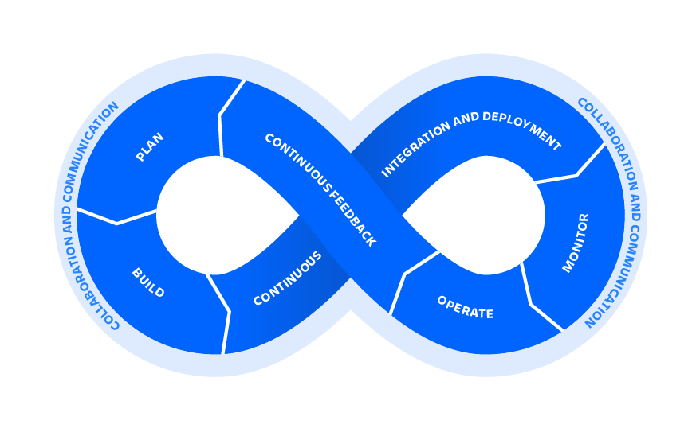

DevOps is a set of [practices](https://www.atlassian.com/devops/what-is-devops/devops-best-practices), [tools](https://www.atlassian.com/devops/devops-tools/choose-devops-tools), and a [cultural philosophy](https://www.atlassian.com/devops/what-is-devops/devops-culture) that automate and integrate the processes between software development and IT teams. It emphasizes team empowerment, cross-team communication and collaboration, and technology automation.

DevOps culture involves closer collaboration and a shared responsibility between development and operations for the products they create and maintain. DevOps culture involves closer collaboration and a shared responsibility between development and operations for the products they create and maintain. At the heart of DevOps culture is **increased transparency, communication, and collaboration** between teams that traditionally worked in siloes. 

DevOps entails **shared responsibilities**. Development and operations staff should both be responsible for the success or failure of a product. Developers are expected to do more than just build and hand off to operations -- they are expected to share the responsibility of overseeing a product through the entire course of its lifetime. They test and operate software and collaborate more with QA and IT Ops.

The most obvious and impactful benefit of embracing a DevOps culture is streamlined, frequent, and high-quality software releases. This not only increases company performance, but also employee satisfaction. 

A DevOps culture fosters high levels of trust and collaboration, results in higher quality decision making, and even higher levels of job satisfaction.

>  Devops isn't any single person's job. It's everyone's job.

## Best practices for implementing DevOps

#### Continuous Integration

Continuous integration is a software development practice where developers regularly merge their code changes into a central repository, after which automated builds and tests are run. The key goals of continuous integration are to find and address bugs quicker, improve software quality, and reduce the time it takes to validate and release new software updates.

### Continuous Delivery

Continuous delivery is a software development practice where code changes are automatically built, tested, and prepared for a release to production. It expands upon continuous integration by deploying all code changes to a testing environment and/or a production environment after the build stage. When continuous delivery is implemented properly, developers will always have a deployment-ready build artifact that has passed through a standardized test process.

##### Shift left with CI/CD

When teams “shift left”, they bring testing into their code development processes early. Instead of sending [multiple changes](https://www.atlassian.com/itsm/change-management/best-practices) to a separate test or QA team, a variety of tests are performed throughout the coding process so that developers can fix bugs or improve code quality while they work on the relevant section of the codebase. The practice of continuous integration and continuous delivery (CI/CD), and deployment underpins the ability to shift left.

##### Automation

Continuous integration and delivery allows developers to merge code regularly into the main repository. Instead of manually checking code, CI/CD automates this process, from batching in a specified window to frequent commits.

#### Monitor the DevOps pipeline and applications

As the industry moved away from monolithic, on-premise systems and applications to cloud-native, microservice-based applications, monitoring is now considerably more complex. As a result, there is an increasing interest in observability. It is often said that the three pillars of observability are **logs**, **traces**, and **metrics**

#### Observability

It’s important to monitor the DevOps pipeline so a broken build or failed test doesn’t cause unnecessary delays. Automation improves the speed of development tremendously, but if there is a failure in an automated process and nobody knows about it, you’re better off doing the work manually

#### Gather continuous feedback

Continuous feedback ensures team members have all the information needed to do their jobs on a timely basis. From the development perspective this entails that the team is alerted to any pipeline failures immediately

#### Change the culture

DevOps requires collaboration, transparency, trust, and empathy. If your organization is one of the rare ones where these qualities are already established, it should be fairly easy for your teams to adopt DevOps practices

#### Microservices

The microservices architecture is a design approach to build a single application as a set of small services. Each service runs in its own process and communicates with other services through a well-defined interface using a lightweight mechanism, typically an HTTP-based application programming interface (API). Microservices are built around business capabilities; each service is scoped to a single purpose. You can use different frameworks or programming languages to write microservices and deploy them independently, as a single service, or as a group of services.

### Infrastructure as Code

Infrastructure as code is a practice in which infrastructure is provisioned and managed using code and software development techniques, such as version control and continuous integration. The cloud’s API-driven model enables developers and system administrators to interact with infrastructure programmatically, and at scale, instead of needing to manually set up and configure resources. Thus, engineers can interface with infrastructure using code-based tools and treat infrastructure in a manner similar to how they treat application code. Because they are defined by code, infrastructure and servers can quickly be deployed using standardized patterns, updated with the latest patches and versions, or duplicated in repeatable ways.

##### Configuration Management

Developers and system administrators use code to automate operating system and host configuration, operational tasks, and more. The use of code makes configuration changes repeatable and standardized. It frees developers and systems administrators from manually configuring operating systems, system applications, or server software.

##### Policy as Code

With infrastructure and its configuration codified with the cloud, organizations can monitor and enforce compliance dynamically and at scale. Infrastructure that is described by code can thus be tracked, validated, and reconfigured in an automated way. This makes it easier for organizations to govern changes over resources and ensure that security measures are properly enforced in a distributed manner (e.g. information security or compliance with PCI-DSS or HIPAA). This allows teams within an organization to move at higher velocity since non-compliant resources can be automatically flagged for further investigation or even automatically brought back into compliance.

## Benefits of DevOps

#### Speed

Move at high velocity so you can innovate for customers faster, adapt to changing markets better, and grow more efficient at driving business results. The DevOps model enables your developers and operations teams to achieve these results. For example, [microservices](https://aws.amazon.com/devops/what-is-devops/#microservices) and [continuous delivery](https://aws.amazon.com/devops/continuous-delivery/) let teams take ownership of services and then release updates to them quicker.

#### Rapid Release and Delivery

Increase the frequency and pace of releases so you can innovate and improve your product faster. The quicker you can release new features and fix bugs, the faster you can respond to your customers’ needs and build competitive advantage. [Continuous integration](https://aws.amazon.com/devops/continuous-integration/) and [continuous delivery](https://aws.amazon.com/devops/continuous-delivery/) are practices that automate the software release process, from build to deploy.

A lack of automated test and review cycles slow the release to production, while poor [incident response](https://www.atlassian.com/incident-management/incident-response) time kills velocity and team confidence. Disparate tools and processes increase operating costs, lead to context switching, and can slow down momentum. Yet with tools that drive automation and new processes, teams can increase productivity and release more frequently with fewer hiccups.

#### Reliability

Ensure the quality of application updates and infrastructure changes so you can reliably deliver at a more rapid pace while maintaining a positive experience for end users. Use practices like [continuous integration](https://aws.amazon.com/devops/continuous-integration/) and [continuous delivery](https://aws.amazon.com/devops/continuous-delivery/) to test that each change is functional and safe. [Monitoring and logging](https://aws.amazon.com/devops/what-is-devops/#monitoring) practices help you stay informed of performance in real-time.

#### Scale

Operate and manage your infrastructure and development processes at scale. Automation and consistency help you manage complex or changing systems efficiently and with reduced risk. For example, [infrastructure as code](https://aws.amazon.com/devops/what-is-devops/#iac) helps you manage your development, testing, and production environments in a repeatable and more efficient manner.

#### Improved Collaboration

Build more effective teams under a DevOps cultural model, which emphasizes values such as ownership and accountability. Developers and operations teams [collaborate](https://aws.amazon.com/devops/what-is-devops/#communication) closely, share many responsibilities, and combine their workflows. This reduces inefficiencies and saves time (e.g. reduced handover periods between developers and operations, writing code that takes into account the environment in which it is run).

#### Security

Move quickly while retaining control and preserving compliance. You can adopt a DevOps model without sacrificing security by using automated compliance policies, fine-grained controls, and configuration management techniques. For example, using infrastructure as code and [policy as code](https://aws.amazon.com/devops/what-is-devops/#policyascode), you can define and then track compliance at scale.

## DevOps Toolchain

A DevOps toolchain includes the tools and technology that enable development and operations teams to collaborate across the entire software lifecycle. It tackles key DevOps fundamentals including [continuous integration](https://www.atlassian.com/continuous-delivery/continuous-integration), [continuous delivery](https://www.atlassian.com/continuous-delivery/pipeline), automation, and collaboration.

If you look across a sophisticated DevOps product, the DevOps toolchain should be able to tackle different parts of the development lifecycle very quickly and offer multiple lenses for different users. It should include development tools that address each phase of the development lifecycle, including continuous integration and delivery, [test automation](https://www.atlassian.com/devops/devops-tools/test-automation), and high-speed deployment. On the operations side of DevOps, tools should include functionality that helps with [monitoring](https://www.atlassian.com/devops/devops-tools/devops-monitoring) and [incident management](https://www.atlassian.com/incident-management). Plus, tools should bridge development and operations by providing continuous feedback and logging.

