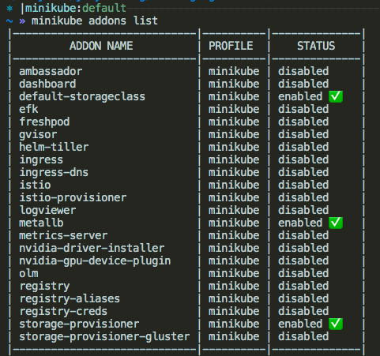
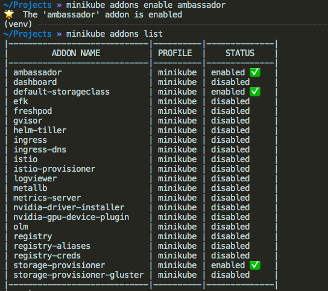
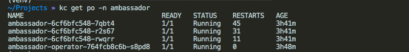

Minikube has been as go to kubernetes cluster on local machine. It helps a lot of us learn and experiment Kubernetes. It is continually adding add-ons. As of v1.11.0 


## Ambassador

 An API gateway acts as a single entry point into a system. It takes all API calls from clients, then routes them to the appropriate microservice with request routing, composition, and protocol translation.  An API gateway is set up in front of the microservices and becomes the entry point for every new request being executed by the app. It simplifies both the client implementations and the microservices app. 

Ambassador is one of many API gateway available for Kubernetes. Luckily it's readily available in Minikube, we just have to enable it. Let's do this!

`minikube addons list` to check all available and enabled addons. You can see ambassador is not yet enable. 



`minikube addons enable ambassador`. 



Ambassador components placed in `ambassador` namespace should be ready in a moment. Let's check by running `kubectl get po -n ambassador`  




So far in minikube there is no default implementation of network load-balancer. Load-balancer will remain in the “pending” state indefinitely when created. Minikube Version 1.10.0-beta.2 has a new powerful addon i.e. MetalLB. MetalLB had addressed the gap and provides the network LoadBalancer implementation as an addon.

Public cloud providers will assign the IP for the load balancer, whereas on bare metal MetalLB is responsible for the allocation of the IP Address.

Let’s see as how we can enable the same in minikube and configure the same with an example.

*minikube addons list* will show that metalLB is disabled.


Enable the addon using the command *minikube addons enable metallb*


Once the addon is enabled, we can see that there are two components that are up and running in the cluster under *metallb-system* namespace. Controller and Speaker are those two components.


The controller helps in the IP address assignment, whereas the speaker advertises layer -2 address.

As we have enabled the addon, now we have to configure the same for the addon to come into effect. We have to configure using the following command *minikube addons configure metallb .*

It will prompt for the IP Address range. As my minikube host IP is 192.168.99.100, I have given the range as below


Check the configuration which is stored in a config map, *kubectl describe configmap config -n metallb-system*


Now let’s try to create the deployment and expose the same using LoadBalancer. As we have got MetalLB configured, we can see the External IP address populated from the IP pool.

```yaml
apiVersion: apps/v1
kind: Deployment
metadata:
  name: hello-blue-whale
spec:
  replicas: 1
  selector:
    matchLabels:
      app: hello-blue-whale-app
  template:
    metadata:
      name: hello-blue-whale-pod
      labels:
        app: hello-blue-whale-app
    spec:
      containers:
      - name: hello-blue-whale-container
        image: vamsijakkula/hello-blue-whale:v1
        imagePullPolicy: Always
        ports:
        - containerPort: 80
      imagePullSecrets:
      - name: regcred
```

```yaml
apiVersion: v1
kind: Service
metadata:
  name: hello-blue-whale-svc
  labels:
    app: hello-blue-whale-app
spec:
  selector:
    app: hello-blue-whale-app
  type: LoadBalancer
  ports:
  - port: 80
    targetPort: 80
```


Access the service using External IP Address(192.168.99.105) over the port 80 and we can see the Blue Whale App. When the service is accessed, the ARP request is sent to find out the MAC Address of the external IP Address and the speaker will respond back with the MAC address.


